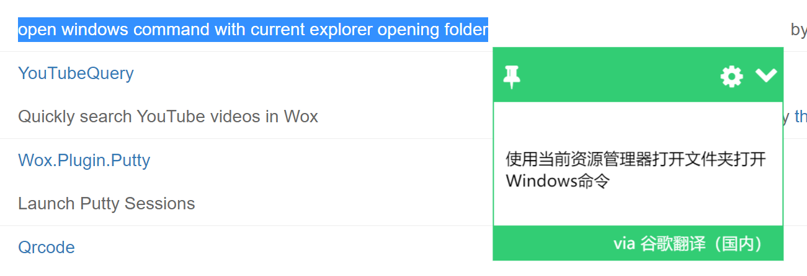

# 搭建舒适的 Windows 环境

## App

### ConEmu64

#### 快捷键
ctrl+shift+t: 唤起 ConEmu。相当于新窗口打开
win+w: 同一个窗口新建，打开目录是当前 User
win+q: 切换不同窗口
win+alt+del: 关闭的当前窗口
win+x: 打开新的 cmd 窗口

TDOO：新建的窗口与当前路径相同。

#### 主题

使用 oh-my-posh 下载主题。但有些字符无法显示是乱码，此时需要[下载 Sarasa-Gothic 字体](https://github.com/be5invis/Sarasa-Gothic/releases)，解压后安装 `ttf` 语言包。在 ConEmu 里选择语言即可。
- [安装字体](https://sspai.com/post/52868)，中 `改进 PowerShell 的字体` 部分。
- [安装主题](https://sspai.com/post/52907)

### [Wox](http://www.wox.one/)

Windows 上的 Alfred。快捷键是 `Alt + Space`
- Find Applications & Files: 可以搜索本机的所有文件，所以有时候输入 app 的时候会出来一堆文件。
- Quick-Search the Web: 输入前缀，会在该网页中搜索。比如输入 github xxx， 在 github 中搜索 xxx。输入 g xxx，在 Google 中搜索xxx。
- [plugins](http://www.wox.one/plugin): 目前还没安装任何插件。
- 其他功能：计算器

### [Snipaste](https://zh.snipaste.com/)
截图软件，可以识别边界。快捷键是`F1`。
缺点是不能录屏，没有腾讯的截图 APP（只有 iOS 版本） 好用。

## 插件

### Chrome 插件
#### 划词翻译

## 全局快捷键

[Windows 全局快捷键](https://support.microsoft.com/zh-cn/help/12445/windows-keyboard-shortcuts)
- 切换应用：`Alt + Tab`, `Alt + Tab + Shift`
- 最小化应用： 最小化所有窗口：`Win + D`（`win + D` 还可以恢复最小化的所有窗口，`win + M` 不行）。最小化当前窗口没有找到快捷键，可用 `Alt + Esc` 来代替，其实是切换到下一个应用，并没有最小化当前窗口，所以如果只开了一个窗口还是用 `Win + D`。
- 最大化应用： `Wni + 上`
- 文本：`Shift + 左右` 选中一个字符。`Shift + Alt + 左右` 选中一个单词/短句。`Pg Up` 文本头，`Pg Dn` 文本尾。`Home` 行首，`End` 行尾。