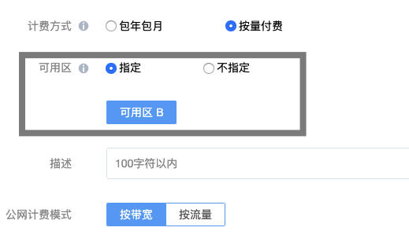

# 编写易维护，易扩展的代码

## 模块逻辑聚合

### 背景
修改表单默认值，可用区由默认不指定改为默认选择指定。表单如下图：



这块的代码如下：
``` vue{3,14}
<u-form>
    ...
    <u-form-item :label="$t('global.az.label')" v-if="!isClassic && currentConfig.support.createByAZ">
        <template slot="extra">
            <u-form-addon>
                <div v-html="$t('eip.az.setTip')"></div>
            </u-form-addon>
        </template>
        <u-radios v-model="setAZ">
            <u-radio :label="1">{{ $t('eip.az.set') }}</u-radio>
            <u-radio :label="0">{{ $t('eip.az.noSet') }}</u-radio>
        </u-radios>
    </u-form-item>
    <u-az v-if="setAZ && !isClassic" v-model="model.ZoneId" :hideLabel="true" :filterClassic="true" :hideazList="[]"></u-az>
    ...
</u-form>
```
由于之前有很多可用区为单独列的情况，这里也将az作为了单独列。但这样为后续维护留下了隐患，所以需要把`u-az`移到与`radios`同一个`u-form-item`中。这也是符合逻辑的设计。移入操作需要再做一些css匹配，可能之前时间不够所以没这么写，**时间不够的情况下最好加上 `TODO:` 注释**。

::: tip
- 自己编写代码时，同一变量控制的模板要聚合在一起，减少一个变量判断多次的情况。
- 修改老代码时，要对修改的变量进行全局搜索验证，同一层级的代码如果由相同变量控制，需要额外 check。
:::
