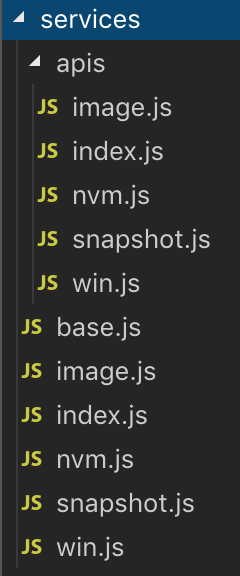

# 构建请求层

请求层是前端与后端交互的基础，构建层次明晰的请求层对后续开发很有益处。

::: tip
从逻辑上自底向上可以分为三层：__基础层(axios发请求，mock数据，通用错误拦截)，apis(定义每个请求) 和 services(复合多个请求)__
:::

```ts{7}
class Api {
    path: string, // 请求路径
    method: string, // 方法
    headers: object, // 头
    query: object, // query string
    body: object, // request body
    config: object, // 自定义配置
}
class Service {
    baseRequest: function, // 发请求的基础函数（即基础层）
    ...apis: object, // 该服务对应的所有api
}
// 调用方式
const nvmService = new Service(nvmApis);
nvmService.list({
    query: {
        Offset: 100,
    },
    config: {
        order: true,
    },
}).then(() =>{}).catch(() => {});
```
项目文件结构如下：



```js{15,28}
// apis/nvm.js
const path = '/nvm';

export default {
    AttachDisk: {
        url: {
            query: {
                Action: 'AttachDisk',
                Version: '2017-12-14',
            },
            method: 'GET',
            path,
        },
        config: {
            noAlert: true, // 错误不需要提示，在 baseRequest 中统一处理
        },
    },
    DownloadInstanceList: {
        url: {
            query: {
                Action: 'DownloadInstanceList',
                Version: '2017-12-14',
            },
            method: 'GET',
            path,
        },
        config: {
            download: true, // 下载请求
        },
    },
}
```
请求架构组织完毕，核心是 baseRequest。<br/>:heartpulse:__baseRequest 可归纳为以下几方面的功能：__
- 请求前封装：是否是 download 请求。如果是 mock 请求直接返回 mock 数据。
- 请求后封装：请求 Code 码统一处理。是否向上层抛错。
- 请求整体封装：对于获取全量数据的请求，比如获取所有云服务器列表，由于接口是分页的，可以在该层分批请求，汇总返回。


__争议__

最初的接口实现版本入口不需要传递这样完整的结构，调用方法为：`service.list({Limit: 10})`。该实现方式需要遵循某些默认原则，比如对于 get 请求，传参为 querystring， 对于 post 请求，传参为 body。这种把多层传参结构通过某些默认规则平铺至一层的方法虽然少打了几个字符，但是可读性和可扩展性大大降低。缺点也很明显，比如对于同一个Action，不能同时传递 querystring 和 body，需要自行拼接URL。

HTTP 作为结构清晰的规范，在开发过程中最好按照其已有结构进行构造，才能充分利用其特性，且增加代码可读性。
