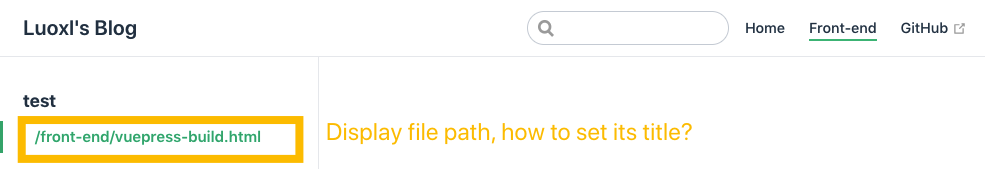

# Working with VuePress

Since this blog is powered by VuePress, the first post is a brief introduction of how to use VuePress to build this site.

This is a record of build steps, problem encountered and optimizable todos.

## Steps
- Follow the steps on [VuePress](https://vuepress.vuejs.org/).
- Use default theme config, set navbar and sidebar configs in config.js as follow. The source code of the project is [GitHub](https://github.com/luoxlgh/vuepress-blog-source).
```js
themeConfig: {
    nav: [
        { text: 'Home', link: '/' },
        { text: 'Front-end', link: '/front-end/' },
        { text: 'GitHub', link: 'https://github.com/luoxlgh/vuepress-blog-source' },
    ],
    sidebar: {
        '/front-end/': [{
            title: '工具',
            collapsable: false,
            children: [
                'vuepress-build',
            ],
        }],
    },
},
```

## Problem
- Sidebar error
when I init this project, and touch an empty file, the sidebar displays wired, and its nowhere to set the title. The [reason](https://vuepress.vuejs.org/default-theme-config/#sidebar) is sidebar is generated by the file's headers.


## TODOS
- Multi-language support.
- Customized home page.
- Automatic navbar and sidebar generation.
